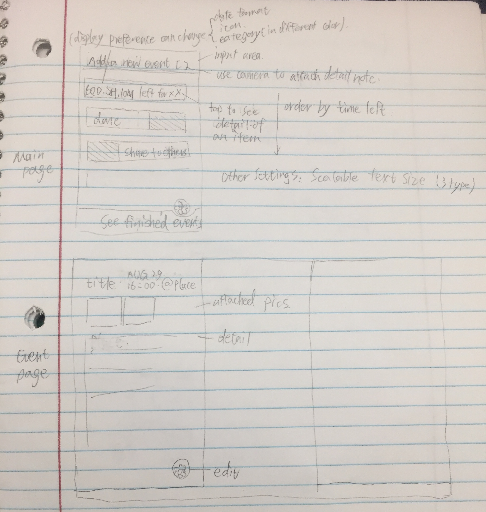
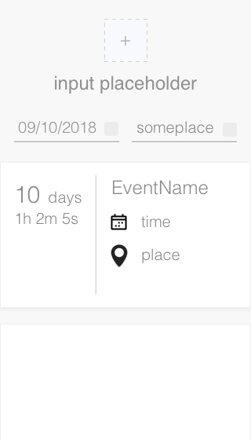

# zp82-project-01

## Manuals (!)

* Add a new event: 
 > type event name over "Hi Barb"
 > push the "+" button
 > select date & type event
 > push "save" button

* Edit a countdown: Hover on the left of event cards

* Delete a countdown: Hover on the right of event cards

* Responsive when scaling down the browser

## Notes on user interview:

Barbara is going on a 11-day honeymoon cruise with her husband Chuck on October 16th, and she is pretty busy before setting off. So she wants a countdown app to remind her how many days are remaining before her honeymoon. Usually she use sticky notes on fridge to remind herself of upcoming tasks, which she thinks is painful, and wants a digital one instead. 

She wants the countdown synchronized on PC and phone with the same experience. She wants to share the countdown with other people, e.g. her husband. Also she finds notifications on phone annoying. She thinks the size of display should be appropriate on computer, and adjustable sizing will be good for her. She does not like the boring UI with some existing apps, and does not like sharing her information to the public on apps.

What's more, Barbara likes cats and has 3 at home. Her favorite colors are pink, black and blue. She is excited for being on the beach, feeling free and having fun.

Wireframe

Prototype created with Sketch

## References

Icons
https://www.iconfinder.com/icons/510932/calendar_date_event_schedule_icon
https://www.iconfinder.com/icons/984761/gps_location_map_navigation_pin_place_icon

Responsive design
https://developers.google.com/web/fundamentals/design-and-ux/responsive/patterns?hl=en
https://internetingishard.com/html-and-css/responsive-design/

localStorage example
https://coderwall.com/p/ewxn9g/storing-and-retrieving-objects-with-localstorage-html5